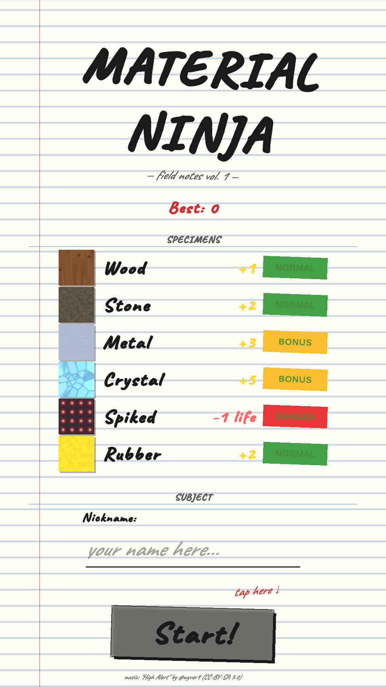

<h1 align="center">Material Ninja</h1>

<p align="center">
  <a href="https://material-ninja.vercel.app"></a>
</p>

<p align="center">
  <b>Slice cubes of wood, stone, metal, crystal, and rubber.</b><br>
  Watch out for the spiked ones.
</p>

<p align="center">
  <a href="https://material-ninja.vercel.app"><b>▶ play in your browser</b></a>
</p>

---

## What it is

A short, browser-playable take on the fruit-ninja formula, restyled as a physics lab field-notebook. Each cube is a different material with its own mass, bounce, point value, and impact sound. Combos chain while the timer's hot. The whole UI looks like it was scribbled into a margin-ruled notebook.

Built in Unity 6, deployed to Vercel as a WebGL bundle with a small serverless leaderboard backed by Upstash Redis.

## How to play

- **Drag the mouse** across cubes to slice them. On mobile, swipe with your finger.
- Wood / Stone / Crystal / Rubber are safe — slice them for points.
- Metal is heavy: the blade drags through it. +3, bonus.
- Spiked is dangerous — slicing it costs a life.
- Three lives. Score climbs while the combo timer is alive.

## Tech

| Layer       | Stack |
|-------------|-------|
| Game        | Unity 6, C#, built-in render pipeline |
| Web shell   | Custom HTML/CSS shell, no framework |
| Audio       | Kenney CC0 SFX, "High Alert" by [@wyver9](https://opengameart.org/content/fast-level-loop-8-bit-chiptune) (CC-BY-SA 3.0), "Funky Menu Loop" by Krocheck (CC0), "Good Morning" by Cakeflaps (CC0+) |
| Backend     | Vercel serverless functions + Upstash Redis (sorted set of personal-best scores) |
| Hosting     | Vercel — static WebGL + `/api/scores` function, served with native Brotli |

## Repo layout

```
Assets/
  Editor/           # build + scene-setup utilities
  Plugins/WebGL/    # .jslib bridge for Unity → JS leaderboard submit
  Prefabs/          # Cube, ComboPopup, CubeInfoRow, SliceBurst
  Scenes/           # StartScene, MainScene
  Scripts/          # gameplay + UI + util
web/                # custom landing page + /api/scores + vercel.json
docs/               # banner image
```

## Build + deploy

Unity:

```text
Tools → Build WebGL
```

Outputs to `Build/WebGL/` (gitignored). The builder also overlays `web/` (custom index.html + API + Vercel config) on top of the Unity output.

Deploy:

```sh
cd Build/WebGL
vercel link --project material-ninja --yes   # only needed after a fresh build
vercel deploy --prod --yes
```

## Credits

- **Music** — "High Alert" by [@wyver9](https://opengameart.org/content/fast-level-loop-8-bit-chiptune) (CC-BY-SA 3.0) · "Funky Menu Loop" by Krocheck (CC0) · "Good Morning" by Cakeflaps (CC0+) · all from [OpenGameArt](https://opengameart.org)
- **SFX** — [Kenney](https://kenney.nl) impact + interface + digital audio packs (CC0)
- **Font** — [Caveat](https://fonts.google.com/specimen/Caveat) by Impallari Type (OFL)

## License

Source code: MIT. Audio retains its original CC-BY-SA / CC0 / OFL licenses as listed above.
